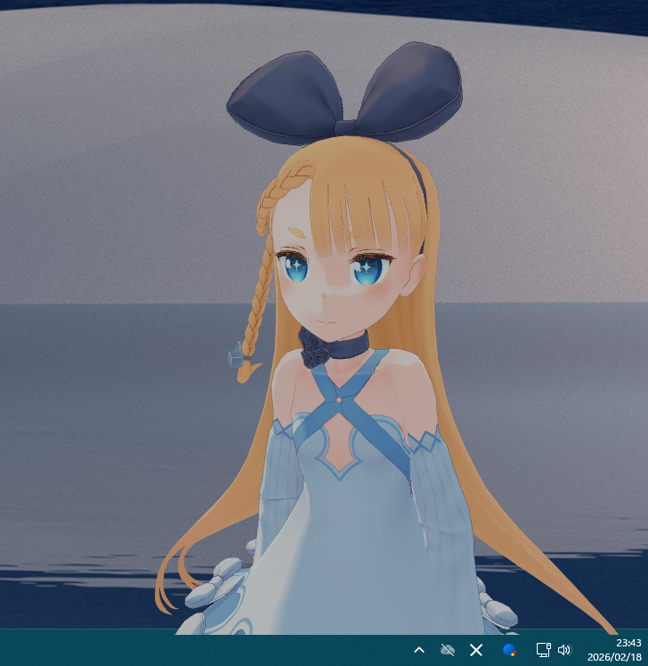

# Desktop Mascot MCP

<p align="center">
  
</p>

[日本語](#japanese) | [English](#english)

---

<a name="japanese"></a>

MCP（Model Context Protocol）対応の AI ツールと連携して、3D キャラクターがデスクトップに常駐するマスコットアプリです。

AI が返答すると、キャラクターが**音声・リップシンク・表情・ジェスチャー**でリアクションします。

## これは何？

**MCP サーバー**とは、AI ツール（Claude Desktop、Cursor など）に機能を追加するプログラムです。このプロジェクトを導入すると、AI ツールから `speak` というコマンドを呼び出せるようになり、3D キャラクターが喋りながら動きます。

```
あなた → AI ツール → speak コマンド → キャラクターが音声・アニメーションで返答
```

> MCP についての詳細: [Model Context Protocol](https://modelcontextprotocol.io/)

---

## ✨ 機能

- **音声合成**: VOICEVOX 互換 API（VOICEVOX / AivisSpeech / COEIROINK など）による音声再生
- **リップシンク**: 音声に合わせた自然な口の動き
- **表情**: 6 種類の感情表現（neutral / happy / sad / angry / surprised / relaxed）
- **ジェスチャー**: VRMA 形式のアニメーション（wave / nod / shake / think など）
- **アイドル**: 放置中にランダムなアニメーションを自動再生
- **透過ウィンドウ**: デスクトップに溶け込む常時最前面ウィンドウ
- **状態の記憶**: カメラ位置・ウィンドウ位置を自動保存

---

## 📋 必要なもの

| 必要なもの | 入手先 |
|---|---|
| Node.js 18 以上 | [nodejs.org](https://nodejs.org/) |
| Git | [git-scm.com](https://git-scm.com/) |
| MCP 対応 AI ツール | [Claude Desktop](https://claude.ai/download) など |
| VOICEVOX 互換 音声合成エンジン | [VOICEVOX](https://voicevox.hiroshiba.jp/) / [AivisSpeech](https://aivis-project.com/) など |
| VRM モデルファイル（.vrm） | 下記参照 |

### VRM モデルの入手

本リポジトリには VRM モデルは含まれていません。お好みの VRM モデルを別途ご用意ください。

無料モデルの例：
- [ニコニ立体ちゃん「アリシア・ソリッド」](https://3d.nicovideo.jp/alicia/) - 商用利用可
- [VRoid Hub](https://hub.vroid.com/) - 配布条件はモデルごとに確認

---

## 🚀 セットアップ

### 1. リポジトリをクローン

```bash
git clone https://github.com/rennosuke-haresu/desktop-mascot-mcp.git
cd desktop-mascot-mcp
npm install
```

### 2. VRM モデルを配置

ダウンロードした `.vrm` ファイルを `assets/models/` に置きます。

```
desktop-mascot-mcp/
└── assets/
    └── models/
        └── YourModel.vrm   ← ここに置く
```

### 3. 設定ファイルを作成

`config.example.json` をコピーして `config.json` を作成します。

```bash
cp config.example.json config.json
```

`config.json` を開き、VRM モデルのパスを書き換えます。

```json
{
  "vrm": {
    "modelPath": "./assets/models/YourModel.vrm"
  }
}
```

その他の設定はそのままでも動きます。[設定の詳細](#設定)を参照してください。

### 4. ビルド

```bash
npm run build:electron
```

### 5. 音声合成エンジンを起動

VOICEVOX 互換の音声合成エンジンを起動しておきます。起動確認：

```bash
# VOICEVOX の場合（デフォルト: 50021番ポート）
curl http://127.0.0.1:50021/version

# AivisSpeech の場合（デフォルト: 10101番ポート）
curl http://127.0.0.1:10101/version
```

### 6. VRM ウィンドウを起動

```bash
npm run start:electron
```

透過ウィンドウが表示され、キャラクターが画面に現れます。

### 7. MCP クライアントに登録

AI ツールの設定ファイルに以下を追加します。

**Claude Desktop の場合**
設定ファイルの場所:
- Windows: `%APPDATA%\Claude\claude_desktop_config.json`
- macOS: `~/Library/Application Support/Claude/claude_desktop_config.json`

```json
{
  "mcpServers": {
    "desktop-mascot-mcp": {
      "command": "node",
      "args": ["/path/to/desktop-mascot-mcp/dist/index.js"],
      "env": {
        "VOICEVOX_SPEAKER_ID": "888753760",
        "VOICEVOX_BASE_URL": "http://127.0.0.1:10101"
      }
    }
  }
}
```

`/path/to/desktop-mascot-mcp/` を実際のパスに変更してください。
Windows の例: `C:/Users/yourname/desktop-mascot-mcp/dist/index.js`

**Cursor / その他の MCP 対応ツール**

各ツールの MCP サーバー設定に同じ `command` / `args` / `env` を指定してください。

### 8. AI ツールを再起動

設定を反映するため AI ツールを再起動します。MCP サーバーが自動的に起動します。

---

## 💬 使い方

### キャラクターに喋らせる

AI ツールのチャットで会話すると、カスタム命令の設定次第でキャラクターが自動的に反応します。

**カスタム命令の設定例（Claude Desktop のプロジェクト設定など）**

```
ユーザーに返答した後、必ず speak ツールを呼び出してください。
- text: 返答内容（日本語）
- emotion: 感情（neutral / happy / sad / angry / surprised / relaxed）
- animation: ジェスチャー（wave / nod / shake / think / clap など）
```

### `speak` ツールのパラメータ

| パラメータ | 必須 | 説明 |
|---|---|---|
| `text` | ✅ | 読み上げるテキスト |
| `emotion` | - | 表情（neutral / happy / sad / angry / surprised / relaxed） |
| `animation` | - | アニメーション名（animations.json で定義したもの） |

### ウィンドウ操作

| 操作 | 動作 |
|---|---|
| マウスドラッグ | カメラ回転 |
| マウスホイール | ズーム |
| ウィンドウドラッグ | ウィンドウ移動 |

カメラ位置・ウィンドウ位置は自動保存され、次回起動時に復元されます。

---

<a name="設定"></a>

## ⚙️ 設定

`config.json` で各種設定を変更できます。変更後は `npm run build:electron` でビルドしてください。

```json
{
  "vrm": {
    "modelPath": "./assets/models/YourModel.vrm"
  },
  "animations": {
    "configPath": "./assets/animations/animations.json"
  },
  "camera": {
    "position": { "x": 0, "y": 1.3, "z": -1.5 },
    "lookAt":   { "x": 0, "y": 1.2, "z": 0 },
    "fov": 45
  },
  "window": {
    "storagePrefix": "desktop-mascot"
  }
}
```

**カメラ設定のヒント**: `camera.lookAt.y` をモデルの顔の高さに合わせると、顔がウィンドウ中央に映ります。

### 環境変数

| 変数名 | デフォルト | 説明 |
|---|---|---|
| `VOICEVOX_BASE_URL` | `http://127.0.0.1:10101` | 音声合成 API の URL |
| `VOICEVOX_SPEAKER_ID` | `888753760` | 話者 ID（エンジンごとに異なります） |

話者 ID は使用する音声合成エンジンの UI や API で確認してください。

**各エンジンのデフォルト URL**:
| エンジン | URL |
|---|---|
| VOICEVOX | `http://127.0.0.1:50021` |
| AivisSpeech | `http://127.0.0.1:10101` |
| COEIROINK | `http://127.0.0.1:50031` |

### アニメーションの追加

アニメーションは **VRMA 形式**（`.vrma`）を使用します。

#### VRMA ファイルの入手方法

**方法 1: VRMA ファイルを直接ダウンロード（最も手軽）**

[BOOTH](https://booth.pm/) では VRMA ファイルが多数配布・販売されています。

- [VRoid 公式による無料配布](https://vroid.booth.pm/items/5512385)（挨拶・ポーズ等 7 種類）
- その他クリエイターによる配布作品も多数あり

**方法 2: FBX から変換（Mixamo など）**

[Mixamo](https://www.mixamo.com/)（Adobe アカウントがあれば無料）などの FBX アニメーションを VRMA に変換できます。

*方法 2a: CLI ツールで変換（Blender 不要）*

[fbx2vrma-converter](https://github.com/tk256ailab/fbx2vrma-converter) を使うと Node.js だけで変換できます。

```bash
node fbx2vrma-converter.js -i input.fbx -o output.vrma
```

Mixamo からダウンロードする際は:
- Format: **FBX**
- Skin: **Without Skin**（スケルトンのみ）

*方法 2b: Blender で変換*

[Blender](https://www.blender.org/) + [VRM Add-on for Blender](https://vrm-addon-for-blender.info/) を使う方法です。

1. Blender に VRM Add-on をインストール・有効化（`編集` → `プリファレンス` → `アドオン`）
2. `ファイル` → `インポート` → `FBX (.fbx)` で読み込む
3. `ファイル` → `エクスポート` → `VRM Animation (.vrma)` で書き出す

**方法 3: 自分でアニメーションを作成**

- [Blender](https://www.blender.org/) + [VRM Add-on for Blender](https://vrm-addon-for-blender.info/): 無料
- [VRM Posing Desktop](https://store.steampowered.com/app/1895630/VRM_Posing_Desktop/)（Steam）: 有料、操作が簡単

---

#### animations.json に登録

> **アニメーションなしの場合**: アニメーションファイルを用意しない場合、または `idle` アニメーションが登録されていない場合、キャラクターは腕を少し下ろした自然なポーズで表示されます。

VRMA ファイルを `assets/animations/` に置いたら `animations.json` に登録します。

```json
{
  "animations": [
    {
      "name": "wave",
      "file": "wave.vrma",
      "loop": false,
      "fadeTime": 0.3,
      "returnToIdle": true,
      "category": "gesture",
      "description": "手を振る"
    }
  ]
}
```

| フィールド | 説明 |
|---|---|
| `name` | アニメーション名（`speak` ツールの `animation` パラメータで指定する名前） |
| `file` | VRMA ファイル名（`assets/animations/` からの相対パス） |
| `loop` | ループ再生するか |
| `fadeTime` | 次のアニメーションへのフェード時間（秒） |
| `returnToIdle` | 再生後にアイドルアニメーションに戻るか |
| `category` | `gesture` / `idle` のいずれか |

---

## ⚠️ トラブルシューティング

### 音声が再生されない

- 音声合成エンジンが起動しているか確認（ポートはエンジンにより異なります）
- `VOICEVOX_SPEAKER_ID` がエンジンで有効な ID か確認
- MCP サーバーのログを確認:
  - Windows: `%APPDATA%\Claude\logs\mcp-server-desktop-mascot-mcp.log`
  - macOS: `~/Library/Logs/Claude/mcp-server-desktop-mascot-mcp.log`

### キャラクターが表示されない

- `npm run start:electron` で VRM ウィンドウを起動しているか確認
- `config.json` の `vrm.modelPath` が正しいか確認
- ウィンドウの DevTools でエラーを確認（`Ctrl+Shift+I`）

### MCP サーバーが認識されない

- `dist/index.js` が存在するか確認（`npm run build:electron` を実行）
- 設定ファイルの JSON が正しいか確認（末尾カンマなどに注意）
- AI ツールを完全に再起動

### アニメーションが動かない

- VRMA ファイルが `assets/animations/` に存在するか確認
- `animations.json` のファイル名と実ファイル名が一致しているか確認
- DevTools コンソールで `[desktop-mascot-mcp] Found N animation configs` のログを確認

---

## 📄 ライセンス

ソースコードは **MIT License** で提供されます。詳細は [LICENSE.md](LICENSE.md) を参照してください。

> **アセットについて**: VRM モデルやアニメーションファイルはリポジトリに含まれていません。
> ご自身でご用意のファイルは、それぞれの配布ライセンスに従ってご利用ください。

---

## 🙏 謝辞

- [VOICEVOX](https://voicevox.hiroshiba.jp/) / [AivisSpeech](https://aivis-project.com/) - 音声合成エンジン
- [Model Context Protocol](https://modelcontextprotocol.io/) - MCP SDK
- [@pixiv/three-vrm](https://github.com/pixiv/three-vrm) - VRM 実装
- [Three.js](https://threejs.org/) - 3D レンダリング
- [Mixamo](https://www.mixamo.com/) - アニメーションデータ

---

---

<a name="english"></a>

# Desktop Mascot MCP

A desktop mascot app that displays a 3D character on your desktop, reacting to your AI tool's responses with **voice, lip-sync, expressions, and gestures** via MCP (Model Context Protocol).

## What is this?

An **MCP server** is a program that extends AI tools (Claude Desktop, Cursor, etc.) with new capabilities. By integrating this project, your AI tool can call the `speak` command to make a 3D character talk and animate in response.

```
You → AI tool → speak command → Character responds with voice & animation
```

> Learn more about MCP: [Model Context Protocol](https://modelcontextprotocol.io/)

---

## ✨ Features

- **Voice synthesis**: Playback via VOICEVOX-compatible APIs (VOICEVOX / AivisSpeech / COEIROINK, etc.)
- **Lip-sync**: Natural mouth movement synchronized with speech
- **Expressions**: 6 emotion types (neutral / happy / sad / angry / surprised / relaxed)
- **Gestures**: VRMA animation support (wave / nod / shake / think, etc.)
- **Idle animations**: Randomly plays animations when idle
- **Transparent window**: Always-on-top window that blends into your desktop
- **State persistence**: Camera and window positions are saved automatically

---

## 📋 Requirements

| Requirement | Where to get |
|---|---|
| Node.js 18+ | [nodejs.org](https://nodejs.org/) |
| Git | [git-scm.com](https://git-scm.com/) |
| MCP-compatible AI tool | [Claude Desktop](https://claude.ai/download), etc. |
| VOICEVOX-compatible TTS engine | [VOICEVOX](https://voicevox.hiroshiba.jp/) / [AivisSpeech](https://aivis-project.com/), etc. |
| VRM model file (.vrm) | See below |

### Getting a VRM model

No VRM model is included in this repository. Please prepare your own.

Free model examples:
- [Niconi Solid "Alicia Solid"](https://3d.nicovideo.jp/alicia/) - commercially usable
- [VRoid Hub](https://hub.vroid.com/) - check each model's license

---

## 🚀 Setup

### 1. Clone the repository

```bash
git clone https://github.com/rennosuke-haresu/desktop-mascot-mcp.git
cd desktop-mascot-mcp
npm install
```

### 2. Place your VRM model

Put your `.vrm` file in `assets/models/`.

```
desktop-mascot-mcp/
└── assets/
    └── models/
        └── YourModel.vrm   ← place here
```

### 3. Create the config file

Copy `config.example.json` to `config.json`.

```bash
cp config.example.json config.json
```

Open `config.json` and set your VRM model path.

```json
{
  "vrm": {
    "modelPath": "./assets/models/YourModel.vrm"
  }
}
```

Other settings work out of the box. See [Configuration](#configuration) for details.

### 4. Build

```bash
npm run build:electron
```

### 5. Start the TTS engine

Start your VOICEVOX-compatible TTS engine. Verify it's running:

```bash
# VOICEVOX (default port: 50021)
curl http://127.0.0.1:50021/version

# AivisSpeech (default port: 10101)
curl http://127.0.0.1:10101/version
```

### 6. Launch the VRM window

```bash
npm run start:electron
```

A transparent window will appear with your character on screen.

### 7. Register as an MCP server

Add the following to your AI tool's config file.

**Claude Desktop**

Config file location:
- Windows: `%APPDATA%\Claude\claude_desktop_config.json`
- macOS: `~/Library/Application Support/Claude/claude_desktop_config.json`

```json
{
  "mcpServers": {
    "desktop-mascot-mcp": {
      "command": "node",
      "args": ["/path/to/desktop-mascot-mcp/dist/index.js"],
      "env": {
        "VOICEVOX_SPEAKER_ID": "888753760",
        "VOICEVOX_BASE_URL": "http://127.0.0.1:10101"
      }
    }
  }
}
```

Replace `/path/to/desktop-mascot-mcp/` with the actual path.
Windows example: `C:/Users/yourname/desktop-mascot-mcp/dist/index.js`

**Cursor / Other MCP-compatible tools**

Use the same `command` / `args` / `env` in each tool's MCP server settings.

### 8. Restart your AI tool

Restart your AI tool to apply the settings. The MCP server will start automatically.

---

## 💬 Usage

### Making the character speak

When you chat with your AI tool, the character will react automatically depending on your custom instructions.

**Example custom instruction (e.g. Claude Desktop project settings)**

```
After responding to the user, always call the speak tool with:
- text: your response text
- emotion: emotion type (neutral / happy / sad / angry / surprised / relaxed)
- animation: gesture name (wave / nod / shake / think / clap, etc.)
```

### `speak` tool parameters

| Parameter | Required | Description |
|---|---|---|
| `text` | ✅ | Text to speak aloud |
| `emotion` | - | Expression (neutral / happy / sad / angry / surprised / relaxed) |
| `animation` | - | Animation name (as defined in animations.json) |

### Window controls

| Action | Effect |
|---|---|
| Mouse drag | Rotate camera |
| Mouse wheel | Zoom |
| Window drag | Move window |

Camera and window positions are saved automatically and restored on next launch.

---

<a name="configuration"></a>

## ⚙️ Configuration

Edit `config.json` to customize settings. Rebuild with `npm run build:electron` after changes.

```json
{
  "vrm": {
    "modelPath": "./assets/models/YourModel.vrm"
  },
  "animations": {
    "configPath": "./assets/animations/animations.json"
  },
  "camera": {
    "position": { "x": 0, "y": 1.3, "z": -1.5 },
    "lookAt":   { "x": 0, "y": 1.2, "z": 0 },
    "fov": 45
  },
  "window": {
    "storagePrefix": "desktop-mascot"
  }
}
```

**Camera tip**: Set `camera.lookAt.y` to the height of your model's face to center it in the window.

### Environment variables

| Variable | Default | Description |
|---|---|---|
| `VOICEVOX_BASE_URL` | `http://127.0.0.1:10101` | TTS API URL |
| `VOICEVOX_SPEAKER_ID` | `888753760` | Speaker ID (varies by engine) |

Check your TTS engine's UI or API to find the correct speaker ID.

**Default URLs by engine**:
| Engine | URL |
|---|---|
| VOICEVOX | `http://127.0.0.1:50021` |
| AivisSpeech | `http://127.0.0.1:10101` |
| COEIROINK | `http://127.0.0.1:50031` |

### Adding animations

Animations use the **VRMA format** (`.vrma`).

#### Getting VRMA files

**Option 1: Download VRMA files directly (easiest)**

[BOOTH](https://booth.pm/) has many VRMA files available for free or purchase.

- [Official VRoid free pack](https://vroid.booth.pm/items/5512385) (greetings, poses, 7 types)
- Many other creator packs available

**Option 2: Convert from FBX (e.g. Mixamo)**

You can convert FBX animations from [Mixamo](https://www.mixamo.com/) (free with an Adobe account) to VRMA.

*Option 2a: Convert via CLI (no Blender needed)*

Use [fbx2vrma-converter](https://github.com/tk256ailab/fbx2vrma-converter) with Node.js only.

```bash
node fbx2vrma-converter.js -i input.fbx -o output.vrma
```

When downloading from Mixamo:
- Format: **FBX**
- Skin: **Without Skin** (skeleton only)

*Option 2b: Convert via Blender*

Use [Blender](https://www.blender.org/) + [VRM Add-on for Blender](https://vrm-addon-for-blender.info/).

1. Install and enable the VRM Add-on (`Edit` → `Preferences` → `Add-ons`)
2. Import via `File` → `Import` → `FBX (.fbx)`
3. Export via `File` → `Export` → `VRM Animation (.vrma)`

**Option 3: Create your own animations**

- [Blender](https://www.blender.org/) + [VRM Add-on for Blender](https://vrm-addon-for-blender.info/): free
- [VRM Posing Desktop](https://store.steampowered.com/app/1895630/VRM_Posing_Desktop/) (Steam): paid, easier to use

---

#### Register in animations.json

> **No animations?** If no animation files are provided, or if no `idle` animation is registered, the character will stand in a natural resting pose.

Place VRMA files in `assets/animations/` and register them in `animations.json`.

```json
{
  "animations": [
    {
      "name": "wave",
      "file": "wave.vrma",
      "loop": false,
      "fadeTime": 0.3,
      "returnToIdle": true,
      "category": "gesture",
      "description": "Wave hand"
    }
  ]
}
```

| Field | Description |
|---|---|
| `name` | Animation name (used as the `animation` parameter in the `speak` tool) |
| `file` | VRMA filename (relative to `assets/animations/`) |
| `loop` | Whether to loop the animation |
| `fadeTime` | Fade duration to the next animation (seconds) |
| `returnToIdle` | Whether to return to idle animation after playback |
| `category` | `gesture` or `idle` |

---

## ⚠️ Troubleshooting

### No audio playback

- Confirm your TTS engine is running (port varies by engine)
- Verify `VOICEVOX_SPEAKER_ID` is valid for your engine
- Check the MCP server log:
  - Windows: `%APPDATA%\Claude\logs\mcp-server-desktop-mascot-mcp.log`
  - macOS: `~/Library/Logs/Claude/mcp-server-desktop-mascot-mcp.log`

### Character not showing

- Confirm the VRM window is running with `npm run start:electron`
- Verify `vrm.modelPath` in `config.json` is correct
- Check for errors in the window's DevTools (`Ctrl+Shift+I`)

### MCP server not recognized

- Confirm `dist/index.js` exists (run `npm run build:electron`)
- Validate your config JSON (watch for trailing commas)
- Fully restart your AI tool

### Animations not playing

- Confirm VRMA files exist in `assets/animations/`
- Check that filenames in `animations.json` match the actual files
- Look for `[desktop-mascot-mcp] Found N animation configs` in the DevTools console

---

## 📄 License

Source code is provided under the **MIT License**. See [LICENSE.md](LICENSE.md) for details.

> **About assets**: VRM models and animation files are not included in this repository.
> Files you provide yourself are subject to their respective distribution licenses.

---

## 🙏 Credits

- [VOICEVOX](https://voicevox.hiroshiba.jp/) / [AivisSpeech](https://aivis-project.com/) - TTS engines
- [Model Context Protocol](https://modelcontextprotocol.io/) - MCP SDK
- [@pixiv/three-vrm](https://github.com/pixiv/three-vrm) - VRM implementation
- [Three.js](https://threejs.org/) - 3D rendering
- [Mixamo](https://www.mixamo.com/) - Animation data
