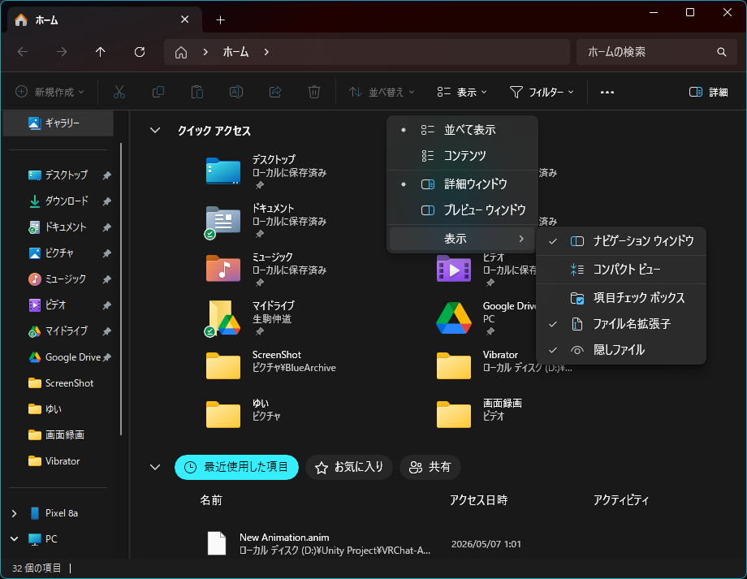
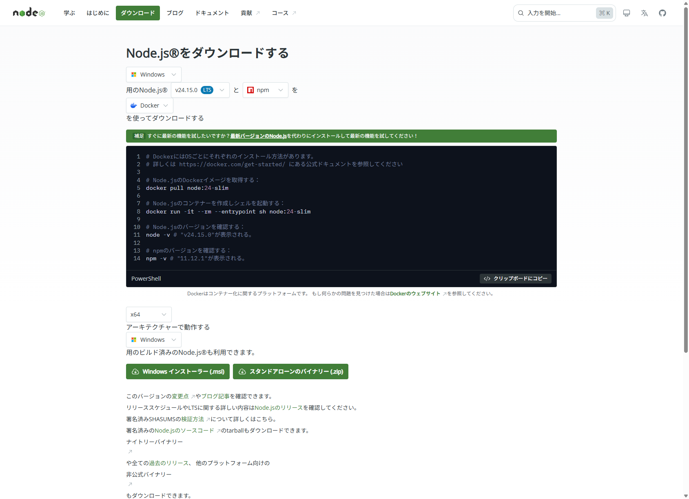
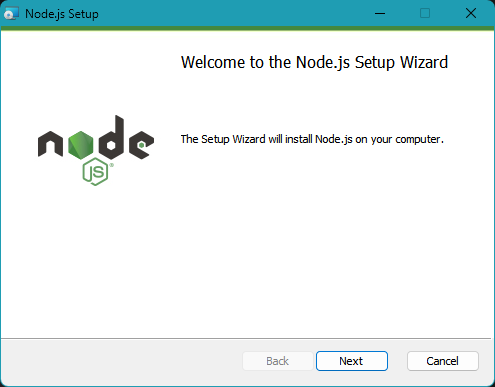
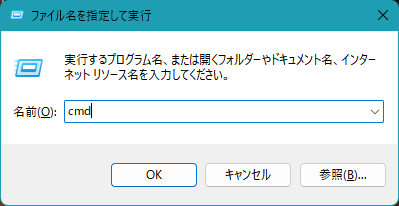
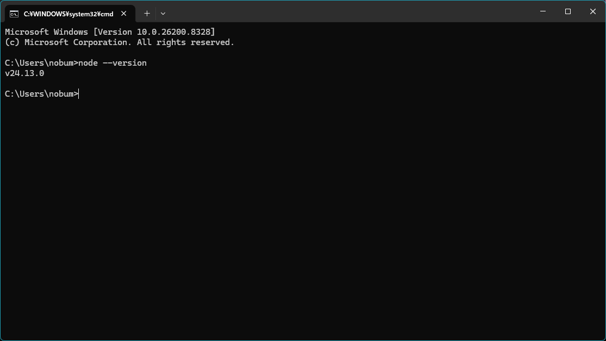
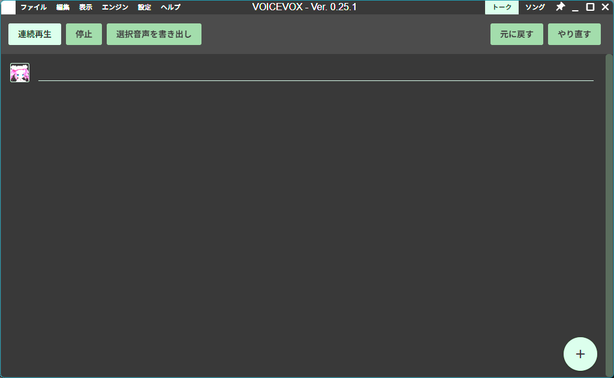
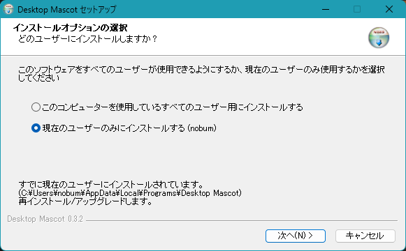
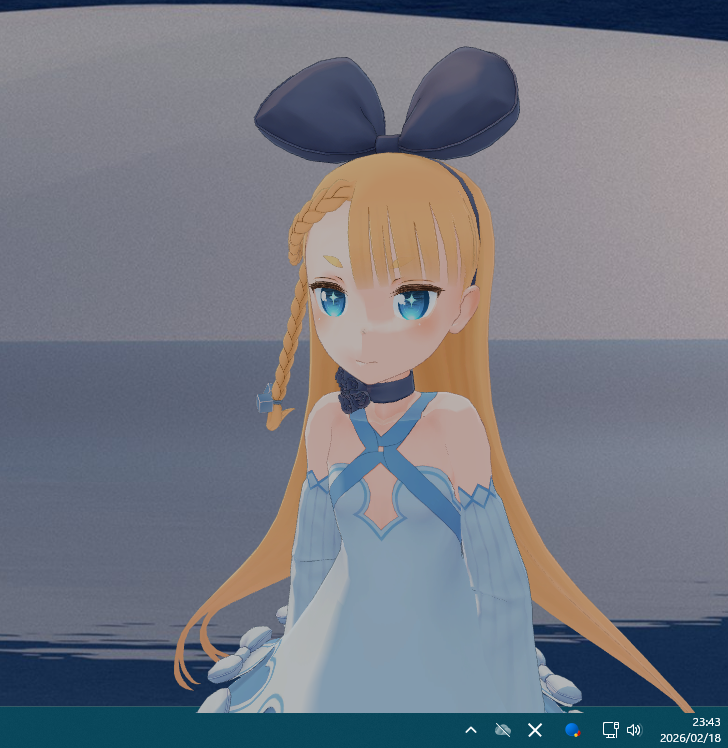

# はじめに / Getting Started

[インストーラー版 (BOOTH)](#booth-ja) | [開発者向け](#dev-ja) | [English (Installer)](#booth-en) | [English (Dev)](#dev-en)

---

<a id="booth-ja"></a>

## インストーラー版セットアップガイド

> BOOTH からダウンロードした方向けのガイドです。プログラミングの知識がなくても大丈夫です。

### このガイドについて

| 項目 | 内容 |
|---|---|
| 所要時間の目安 | 約 30〜60 分 |
| 必要な事前知識 | なし |
| 「コマンドプロンプト」という黒い画面を使う場面 | 2 回だけ |

**全体の流れ:**

1. ファイルの拡張子を表示する（準備）
2. Node.js をインストールする
3. VOICEVOX をインストールする
4. Desktop Mascot をインストールする
5. VRM モデル（3D キャラクター）を配置する
6. 設定ファイルを作る
7. Claude Desktop に MCP を登録する
8. 起動して動作確認する

---

### ステップ 1: ファイルの拡張子を表示する

> **なぜ必要か:** あとの手順で `.json` という名前のファイルを作ります。Windows の初期設定では拡張子（ファイル名の末尾 `.json` など）が隠れて見えないため、先にオンにしておきます。

**Windows 11 の場合:**

1. エクスプローラーを開く（タスクバーのフォルダアイコン）
2. 上部メニューの「**表示**」をクリック
3. 「**表示**」→「**ファイル名拡張子**」にチェックを入れる



**Windows 10 の場合:**

1. エクスプローラーを開く
2. 上部の「**表示**」タブをクリック
3. 「**ファイル名拡張子**」にチェックを入れる

✅ フォルダ内のファイルに `.txt` `.json` などが表示されるようになれば OK です。

---

### ステップ 2: Node.js をインストールする

> **Node.js とは?** アプリを動かすために必要なプログラムです。インストールしたら普段は意識しなくて OK です。

**1. Node.js をダウンロードする**

[nodejs.org/ja/download](https://nodejs.org/ja/download) にアクセスします。ページを開くと、お使いの OS（Windows）が自動的に選択されています。



ページを少し下にスクロールすると、「**Windows インストーラー (.msi)**」という緑色のボタンが表示されます。クリックしてダウンロードします。

> ページ途中に黒い背景のコードが表示されますが、無視して構いません（Docker という別の用途向けの説明です）。

> 「LTS」は Long-Term Support の略で、安定版という意味です。特にこだわりがなければそのままで OK です。

**2. インストーラーを実行する**

ダウンロードした `.msi` ファイルをダブルクリックして実行します。「次へ」「同意する」を押し続けるだけでインストールできます。途中の設定はすべてデフォルト（初期値）のままで大丈夫です。



**3. インストールを確認する**

インストール後、コマンドプロンプトを開いて確認します。

> **コマンドプロンプトの開き方:**
> - `Windows キー + R` を同時に押す → `cmd` と入力 → `Enter` を押す
> - または: スタートボタンを右クリック → 「ターミナル」または「コマンドプロンプト」を選ぶ



黒い画面が開いたら、以下をそのまま入力して `Enter` を押します:

```
node --version
```

`v24.x.x` のような数字が表示されれば成功です（`v18` 以上であれば OK）。



> **表示されない場合:** PC を一度再起動してから再度試してください。

---

### ステップ 3: VOICEVOX をインストールする

> **VOICEVOX とは?** キャラクターの声を作る無料のアプリです。Desktop Mascot を使うたびに、このアプリも起動しておく必要があります。

**1. VOICEVOX をダウンロードする**

[voicevox.hiroshiba.jp](https://voicevox.hiroshiba.jp/) にアクセスして「**ダウンロード**」をクリックします。Windows 版をダウンロードしてください。

**2. インストールして起動する**

インストーラーを実行してインストールし、VOICEVOX を起動します。起動するとキャラクター選択画面やテキスト入力欄が表示されます。



⚠️ **VOICEVOX は Desktop Mascot を使う間、ずっと起動したままにしておいてください。**

**3. 起動を確認する（任意）**

確認したい場合は、ブラウザのアドレスバーに以下を入力してみてください:

```
http://127.0.0.1:50021/speakers
```

英語のテキストがたくさん表示されれば正常に動作しています。

---

### ステップ 4: Desktop Mascot をインストールする

BOOTH からダウンロードしたファイルを使ってインストールします。

#### インストーラー版（`.exe`）の場合

**1. インストーラーを実行する**

`DesktopMascot-Setup-x.x.x.exe` をダブルクリックして実行します。



- 「次へ」を押してインストール先を選択します（変更しなくて OK）
- 「インストール」をクリックしてインストールを完了させます
- デスクトップにショートカットが作成されます

**2. インストールされたフォルダを確認する**

デスクトップの「Desktop Mascot」ショートカットを **右クリック** → 「**ファイルの場所を開く**」をクリックすると、インストール先フォルダが開きます。

インストール先フォルダの構成（後で使うのでメモしておきましょう）:

```
Desktop Mascot のインストール先\
├── Desktop Mascot.exe          ← アプリ本体
├── resources\
│   ├── app\
│   │   └── dist\
│   │       └── renderer\       ← ここに config.json を作る（ステップ 6）
│   │           └── assets\
│   │               └── models\ ← ここに VRM ファイルを入れる（ステップ 5）
│   └── mcp\
│       └── index.js            ← このファイルのパスをメモしておく（ステップ 7 で使用）
└── ...
```

> **`index.js` のパスのメモ方法:** `mcp` フォルダを **Shift キーを押しながら右クリック** → 「**パスとしてコピー**」を選ぶと、フォルダのパスがコピーできます。末尾に `\index.js` を付け加えてメモしておきます。

<details>
<summary>📦 ZIP 版（ポータブル）をダウンロードした方はこちら</summary>

**ZIP 版の展開手順:**

1. ダウンロードした `.zip` ファイルを右クリック
2. 「**すべて展開**」をクリック
3. 展開先フォルダを選んで「展開」をクリック

展開後のフォルダ構成はインストーラー版と同じです。展開したフォルダを覚えておいてください。

</details>

---

### ステップ 5: VRM モデルを用意して配置する

> **VRM とは?** 3D キャラクターのファイル形式です（`.vrm` という拡張子）。自分の好きなキャラクターを使えます。

**1. VRM ファイルを用意する**

まだお持ちでない場合は、以下から無料で入手できます:

- **[VRoid Hub](https://hub.vroid.com/)** — 無料アカウントを作成してダウンロード（多数のモデルあり）
- **[BOOTH](https://booth.pm/)** — 「VRM」で検索すると無料・有料モデルが見つかります

> VRM ファイルを配布している場合、利用規約をご確認ください。

**2. VRM ファイルを配置する**

インストール先フォルダの `resources\app\dist\renderer\assets\models\` フォルダに VRM ファイルをコピーします。

エクスプローラーで以下の順にフォルダをたどってください:

```
インストール先 → resources → app → dist → renderer → assets → models
```

> `models` フォルダが存在しない場合は、`assets` フォルダを右クリック → 「新規作成」→「フォルダー」で作成してください。

VRM ファイル（例: `MyCharacter.vrm`）をそのフォルダにコピーまたは移動します。

> ⚠️ ファイル名はあとで使うので覚えておいてください（例: `MyCharacter.vrm`）。

---

### ステップ 6: 設定ファイルを作る

> **設定ファイル（`config.json`）とは?** 「どの VRM モデルを使うか」などをアプリに伝えるためのファイルです。一度作れば毎回必要なものではありません。

**1. テキストエディタを用意する**

設定ファイルはテキストエディタで作成します。Windows に標準搭載の「**メモ帳**」が使えます。

> 💡 **おすすめ:** 無料の [Visual Studio Code (VSCode)](https://code.visualstudio.com/) を使うと文字コードの問題が起きにくく、今後も何かと便利です。

**2. ファイルを作成する**

①「スタート」→「メモ帳」を開きます。

② 以下の内容をそのまま入力します（コピー＆ペーストでも OK）:

```json
{
  "vrm": {
    "modelPath": "./assets/models/MyCharacter.vrm"
  }
}
```

③ `MyCharacter.vrm` の部分を、ステップ 5 でコピーした **VRM ファイルの名前** に変更します。

> 例: VRM ファイルが `Hana.vrm` なら `"./assets/models/Hana.vrm"` にします。

**3. ファイルを保存する**

① 「ファイル」→「**名前を付けて保存**」を選びます。

② 以下の設定で保存します:

- **保存先**: インストール先の `resources\app\dist\renderer\` フォルダ
- **ファイル名**: `config.json`（`"` で囲んで `"config.json"` と入力するのが確実）
- **ファイルの種類**: 「すべてのファイル」を選ぶ
- **文字コード**: 「UTF-8」を選ぶ（Windows 11 はデフォルトで OK）

④ 「保存」をクリックします。

**4. 確認する**

保存先フォルダを開いて `config.json` というファイルが作成されていれば OK です。

> ⚠️ `config.json.txt` という名前になっていたら失敗です。ステップ 1 の拡張子表示がオンになっているか確認し、「ファイルの種類」を「すべてのファイル」にして保存し直してください。

---

### ステップ 7: Claude Desktop をインストール・設定する

> **Claude Desktop とは?** AI（Claude）と会話できるアプリです。このアプリに「Desktop Mascot のキャラクターを動かす機能」を登録します。

**1. Claude Desktop をインストールする**

[claude.ai/download](https://claude.ai/download) からダウンロードしてインストールします。

**2. MCP 設定ファイルを開く（または作る）**

> **MCP とは?** Claude Desktop とキャラクターをつなぐための設定です。一度設定すれば毎回は不要です。

① `Windows キー + R` を押して、以下を入力して `Enter` を押します:

```
%APPDATA%\Claude\
```

`Claude` というフォルダが開きます。

② フォルダの中に `claude_desktop_config.json` があるか確認します:

- **あった場合**: そのファイルをダブルクリックしてメモ帳で開きます
- **なかった場合**: メモ帳を開いて新規作成します

**3. `index.js` のパスを確認する**

ステップ 4 でメモした `index.js` のパスを用意します。メモしていない場合:

① Desktop Mascot のインストール先フォルダを開く（ショートカット右クリック → ファイルの場所を開く）

② `resources` → `mcp` フォルダを開く

③ `mcp` フォルダを **Shift キーを押しながら右クリック** → 「**パスとしてコピー**」

コピーしたパスの末尾に `\index.js` を追加して、`\` を `/` に置き換えます。

> **例:** `C:\Users\yamada\AppData\Local\Programs\Desktop Mascot\resources\mcp` だった場合
>
> → `C:/Users/yamada/AppData/Local/Programs/Desktop Mascot/resources/mcp/index.js`

**4. 設定を書き込む**

メモ帳に以下の内容を入力します（すでに内容がある場合は後述の注意を参照）:

```json
{
  "mcpServers": {
    "desktop-mascot": {
      "command": "node",
      "args": ["ここにステップ3で調べたパスを入れる"],
      "env": {
        "VOICEVOX_BASE_URL": "http://127.0.0.1:50021",
        "VOICEVOX_SPEAKER_ID": "3"
      }
    }
  }
}
```

`"args"` の `"ここにステップ3で調べたパスを入れる"` を実際のパスに書き換えます。

**記入例:**

```json
{
  "mcpServers": {
    "desktop-mascot": {
      "command": "node",
      "args": ["C:/Users/yamada/AppData/Local/Programs/Desktop Mascot/resources/mcp/index.js"],
      "env": {
        "VOICEVOX_BASE_URL": "http://127.0.0.1:50021",
        "VOICEVOX_SPEAKER_ID": "3"
      }
    }
  }
}
```

> ⚠️ **すでにファイルに内容がある場合:** `"mcpServers": {` の中に追記します。既存の設定と混在させる場合は、前の設定の末尾 `}` の後にカンマ `,` を追加してから次の設定を書きます。わからなければ[README のトラブルシューティング](../README.md)を参照してください。

**5. よくある間違い（ここは重要！）**

❌ **パスに `\`（バックスラッシュ）が残っている** → `/`（スラッシュ）に全部変えてください

❌ **末尾のカンマ（trailing comma）** → JSON では最後の項目の後にカンマを付けてはいけません

```json
// ✅ 正しい
{
  "VOICEVOX_BASE_URL": "http://127.0.0.1:50021",
  "VOICEVOX_SPEAKER_ID": "3"
}

// ❌ 間違い（最後の行の後にカンマがある）
{
  "VOICEVOX_BASE_URL": "http://127.0.0.1:50021",
  "VOICEVOX_SPEAKER_ID": "3",
}
```

❌ **ファイルが `claude_desktop_config.json.txt` になっている** → 「ファイルの種類: すべてのファイル」で保存し直してください

**6. 保存する**

- ファイル名: `claude_desktop_config.json`
- ファイルの種類: 「すべてのファイル」
- 文字コード: UTF-8
- 保存先: `%APPDATA%\Claude\` フォルダ

**7. Claude Desktop を完全に終了して再起動する**

① タスクバー右の通知領域（右下の隠れているアイコン ∧ ）に Claude のアイコンがあれば右クリック → 「**終了**」または「**Quit**」

② Claude Desktop を再度起動します

---

### ステップ 8: 起動して動作確認する

**起動する順番が大事です。** 以下の順で起動してください:

| 順番 | アプリ | 確認方法 |
|---|---|---|
| 1 | **VOICEVOX** | ウィンドウが表示されていれば OK |
| 2 | **Desktop Mascot.exe** | 透過ウィンドウにキャラクターが表示されれば OK |
| 3 | **Claude Desktop** | ステップ 7 の再起動後の状態 |

Desktop Mascot が起動すると、画面上に 3D キャラクターが表示されます。



> **ウィンドウの操作方法:**
> - ウィンドウの端をドラッグ → ウィンドウの移動
> - キャラクターの上をドラッグ → カメラの回転
> - スクロール → ズームイン・ズームアウト
> - `Ctrl + ,`（カンマ） → 設定モード（ウィンドウのリサイズや移動がしやすくなります）

**動作確認:**

Claude Desktop を開いて Claude に話しかけます。Claude が返答するときにキャラクターが喋って表情が変われば完成です！ 🎉

> 💡 **ヒント（より確実に喋らせたい場合）:** Claude Desktop の設定でシステムプロンプトを以下のように設定すると、キャラクターが確実に声を出すようになります:
>
> ```
> 返答するときは必ず speak ツールを呼び出してください。
> text に返答内容、emotion に感情（neutral/happy/sad/angry/surprised/relaxed）を設定してください。
> ```

---

### ステップ 9（任意）: アニメーションを追加する

> **アニメーションとは?** キャラクターが喋るときに手を振ったり頷いたりするモーションです。VRMA 形式（`.vrma`）のファイルを追加することで動作します。このステップは任意で、設定しなくてもアプリは問題なく使えます。

**1. VRMA ファイルを用意する**

以下から無料で入手できます:

- **[VRoid 公式 BOOTH](https://vroid.booth.pm/items/5512385)** — 挨拶・ポーズ等 7 種類、無料
- **[BOOTH](https://booth.pm/)** で「VRMA」と検索すると多数見つかります

> VRM ファイルと同様に、利用規約をご確認ください。

**2. VRMA ファイルを配置する**

エクスプローラーでインストール先フォルダから以下の順にたどります:

```
インストール先 → resources → app → dist → renderer → assets → animations
```

その `animations` フォルダに VRMA ファイルをコピーします。

> `animations` フォルダが存在しない場合は、`assets` フォルダを右クリック → 「新規作成」→「フォルダー」で作成してください。

**3. animations.json を作る**

`animations` フォルダの中に `animations.example.json` というファイルが最初から入っています。これをコピーして `animations.json` という名前にします。

① `animations.example.json` を右クリック → 「**コピー**」
② 同じフォルダ内に貼り付け（`Ctrl + V`）
③ 貼り付けたファイルを右クリック → 「**名前の変更**」→ `animations.json` に変更

次に `animations.json` をメモ帳で開き、`"file"` の値を実際に配置した VRMA ファイル名に変更します:

```json
{
  "animations": [
    {
      "name": "wave",
      "file": "wave.vrma",
      "loop": false,
      "fadeTime": 0.3,
      "returnToIdle": true,
      "category": "gesture"
    }
  ]
}
```

| フィールド | 説明 |
|---|---|
| `name` | Claude への指示で使う名前（英語小文字推奨） |
| `file` | VRMA ファイル名（animations フォルダに置いたファイル名） |
| `loop` | `true` でループ、`false` で 1 回再生 |
| `returnToIdle` | `true` にすると再生後に待機ポーズに戻る |
| `category` | `"gesture"`（ジェスチャー）または `"idle"`（待機中） |

VRMA ファイルが複数ある場合は `{ ... }` のブロックをカンマ区切りで並べます。

**4. config.json にアニメーション設定を追加する**

ステップ 6 で作った `config.json` をメモ帳で開き、`"vrm"` セクションの後に追記します:

```json
{
  "vrm": {
    "modelPath": "./assets/models/MyCharacter.vrm"
  },
  "animations": {
    "configPath": "./assets/animations/animations.json"
  }
}
```

> ⚠️ `"vrm": { ... }` の末尾の `}` の後に `,`（カンマ）を追加してから `"animations"` を書いてください。

**5. Desktop Mascot を再起動する**

Desktop Mascot を一度終了し、再度 `Desktop Mascot.exe` を起動します。

**6. Claude にアニメーションを使わせる**

Claude Desktop のシステムプロンプトに `animation` の指示を追加すると、返答のたびにジェスチャーが出るようになります:

```
返答するときは必ず speak ツールを呼び出してください。
text に返答内容、emotion に感情（neutral/happy/sad/angry/surprised/relaxed）を設定してください。
アニメーションは animation に名前（wave / nod など）を設定してください。
```

---

### うまくいかない場合

| 症状 | ありがちな原因 | 確認すること |
|---|---|---|
| キャラクターが表示されない | `config.json` のファイル名・場所・内容の誤り | ① `config.json` が `resources\app\dist\renderer\` にあるか<br>② `modelPath` のファイル名が VRM ファイルの名前と一致しているか<br>③ `config.json.txt` になっていないか |
| 「node が見つからない」エラー | Node.js が未インストール、またはインストール後に PC を再起動していない | ステップ 2 に戻る。再起動してから `node --version` を実行してみる |
| 音が出ない | VOICEVOX が起動していない、またはポート番号の不一致 | ① VOICEVOX が起動しているか確認<br>② ブラウザで `http://127.0.0.1:50021/speakers` を開いてみる |
| MCP サーバーが認識されない | JSON の構文エラー、またはパスの誤り | ① `claude_desktop_config.json` のパスに誤字がないか<br>② `\` を `/` にすべて変換したか<br>③ 末尾のカンマ（trailing comma）がないか<br>④ Claude Desktop を完全に再起動したか |
| キャラクターは表示されるが喋らない | VOICEVOX が起動していない、または MCP が未登録 | VOICEVOX を起動してから Claude で話しかける。MCP の登録を確認する |

それでも解決しない場合は [README のトラブルシューティング](../README.md) も参照してください。

---

<a id="dev-ja"></a>

## 開発者向けセットアップ

> ソースコードから動かしたい方・開発に参加したい方はこちら。

### ステップ0: 必要なものを揃える

- [ ] **VRM モデルファイル**（`.vrm`）— 無料モデルの入手先: [VRoid Hub](https://hub.vroid.com/) / [BOOTH](https://booth.pm/)
- [ ] **VOICEVOX 互換 TTS エンジン**（以下のいずれか）
  - [VOICEVOX](https://voicevox.hiroshiba.jp/) — ポート: `50021`（クロスプラットフォーム）
  - [AivisSpeech](https://aivis-project.com/) — ポート: `10101`（Windows のみ）
  - [COEIROINK](https://coeiroink.com/) — ポート: `50031`
- [ ] **Node.js 18+** — [nodejs.org](https://nodejs.org/)
- [ ] **Claude Desktop**（または MCP 対応 AI ツール）

---

### ステップ1: リポジトリをセットアップする

```bash
git clone https://github.com/rennosuke-haresu/desktop-mascot-mcp.git
cd desktop-mascot-mcp
npm install
```

`config.example.json` をコピーして `config.json` を作成し、VRM モデルのパスを設定します。

```bash
cp config.example.json config.json
```

`config.json` を編集してモデルパスを変更します：

```json
{
  "vrm": {
    "modelPath": "./assets/models/YourModel.vrm"
  }
}
```

VRM ファイルを `assets/models/` フォルダに置いてください。

ビルドを実行します：

```bash
npm run build:electron
```

---

### ステップ2: TTS エンジンを起動して確認する

TTS エンジンを起動したあと、以下のコマンドで動作を確認します：

```bash
# VOICEVOX の場合
curl http://127.0.0.1:50021/speakers

# AivisSpeech の場合
curl http://127.0.0.1:10101/speakers
```

---

### ステップ3: デスクトップマスコットを起動する

```bash
npm run start:electron
```

---

### ステップ4: Claude Desktop に登録する

`%APPDATA%\Claude\claude_desktop_config.json` を開いて `mcpServers` に追加します：

```json
{
  "mcpServers": {
    "desktop-mascot-mcp": {
      "command": "node",
      "args": ["C:/Users/yourname/desktop-mascot-mcp/dist/index.js"],
      "env": {
        "VOICEVOX_BASE_URL": "http://127.0.0.1:50021",
        "VOICEVOX_SPEAKER_ID": "3"
      }
    }
  }
}
```

保存後、**Claude Desktop を完全に再起動**します。

---

### うまくいかない場合

| 症状 | 確認点 |
|---|---|
| キャラクターが表示されない | `config.json` の `modelPath` が正しいか / `npm run start:electron` が動いているか |
| 音が出ない | TTS エンジンが起動しているか / `VOICEVOX_SPEAKER_ID` がエンジンで有効な値か |
| MCP サーバーが認識されない | `dist/index.js` が存在するか（`npm run build:electron` を再実行） / JSON 構文エラー（末尾カンマに注意） |

詳細なトラブルシューティングは [README](../README.md) を参照してください。

---

<a id="booth-en"></a>

## Installer Setup Guide (BOOTH)

> For users who downloaded the zip from BOOTH.

### Requirements

| Item | Where to get it | Notes |
|---|---|---|
| **Node.js 18+** | [nodejs.org](https://nodejs.org/) | Choose the "LTS" version |
| **VOICEVOX-compatible TTS engine** | See below | Used for character voice |
| **VRM model file** (`.vrm`) | [VRoid Hub](https://hub.vroid.com/) / [BOOTH](https://booth.pm/) | Your 3D character |
| **MCP-compatible AI tool** | [Claude Desktop](https://claude.ai/download) etc. | Connects AI to the character |

**VOICEVOX-compatible engines:**

This app works with any VOICEVOX-compatible API.

| Engine | Download | Port | OS |
|---|---|---|---|
| **VOICEVOX** (recommended) | [voicevox.hiroshiba.jp](https://voicevox.hiroshiba.jp/) | 50021 | Win / Mac / Linux |
| COEIROINK | [coeiroink.com](https://coeiroink.com/) | 50031 | Windows |
| AivisSpeech | [aivis-project.com](https://aivis-project.com/) | 10101 | Windows only |

---

### Step 1: Install Node.js

Go to [nodejs.org](https://nodejs.org/) and download the **LTS** version.

Verify in a command prompt:

```
node --version
```

You should see `v18.x.x` or higher.

---

### Step 2: Extract Desktop Mascot

Extract the downloaded zip to any location (e.g., `C:\DesktopMascot\`).

---

### Step 3: Place your VRM model

Copy your `.vrm` file into:

```
resources\app\dist\renderer\assets\models\
```

Create the folder if it doesn't exist.

---

### Step 4: Create config.json

Open `resources\app\dist\renderer\` and create `config.json`:

```json
{
  "vrm": {
    "modelPath": "./assets/models/MyCharacter.vrm"
  }
}
```

Replace `MyCharacter.vrm` with your actual filename.

---

### Step 5: Start your TTS engine

Verify it's running:

```
# For VOICEVOX
curl http://127.0.0.1:50021/speakers
```

A JSON list of speakers means it's working.

---

### Step 6: Register the MCP server

Open or create `%APPDATA%\Claude\claude_desktop_config.json`:

```json
{
  "mcpServers": {
    "desktop-mascot": {
      "command": "node",
      "args": ["C:/DesktopMascot/resources/mcp/index.js"],
      "env": {
        "VOICEVOX_BASE_URL": "http://127.0.0.1:50021",
        "VOICEVOX_SPEAKER_ID": "3"
      }
    }
  }
}
```

> Use forward slashes `/` in the path. Adjust `VOICEVOX_BASE_URL` to match your engine's port.

Save and **fully restart Claude Desktop**.

---

### Step 7: Launch the mascot

Double-click `Desktop Mascot.exe`. Your character should appear in a transparent window.

---

### Step 8: Verify

1. Desktop Mascot is running
2. TTS engine is running
3. Send a message to Claude Desktop

If the character speaks and changes expression — you're done! 🎉

---

### Troubleshooting

| Symptom | What to check |
|---|---|
| Character not showing | Check `modelPath` in `config.json` / verify VRM file location |
| "node not found" error | Make sure Node.js is installed (Step 1) |
| No audio | Check TTS engine is running / verify port in `VOICEVOX_BASE_URL` |
| MCP server not recognized | Check path in config for typos / use `/` not `\` / restart Claude Desktop |

---

<a id="dev-en"></a>

## Developer Setup

> For those building from source or contributing.

### Step 0: Gather what you need

- [ ] **A VRM model file** (`.vrm`) — Free models: [VRoid Hub](https://hub.vroid.com/) / [BOOTH](https://booth.pm/)
- [ ] **A VOICEVOX-compatible TTS engine** (choose one):
  - [VOICEVOX](https://voicevox.hiroshiba.jp/) — Port: `50021` (cross-platform)
  - [AivisSpeech](https://aivis-project.com/) — Port: `10101` (Windows only)
  - [COEIROINK](https://coeiroink.com/) — Port: `50031`
- [ ] **Node.js 18+** — [nodejs.org](https://nodejs.org/)
- [ ] **Claude Desktop** (or another MCP-compatible AI tool)

---

### Step 1: Set up the repository

```bash
git clone https://github.com/rennosuke-haresu/desktop-mascot-mcp.git
cd desktop-mascot-mcp
npm install
cp config.example.json config.json
```

Edit `config.json` with your VRM model path, then build:

```bash
npm run build:electron
```

---

### Step 2: Start your TTS engine and verify

```bash
# For VOICEVOX
curl http://127.0.0.1:50021/speakers
```

---

### Step 3: Launch the mascot

```bash
npm run start:electron
```

---

### Step 4: Register with Claude Desktop

Add to `%APPDATA%\Claude\claude_desktop_config.json`:

```json
{
  "mcpServers": {
    "desktop-mascot-mcp": {
      "command": "node",
      "args": ["C:/Users/yourname/desktop-mascot-mcp/dist/index.js"],
      "env": {
        "VOICEVOX_BASE_URL": "http://127.0.0.1:50021",
        "VOICEVOX_SPEAKER_ID": "3"
      }
    }
  }
}
```

Save and fully restart Claude Desktop.

---

### Troubleshooting

| Symptom | What to check |
|---|---|
| Character not showing | Verify `modelPath` in `config.json` / confirm `npm run start:electron` is running |
| No audio | Verify TTS engine is running / confirm `VOICEVOX_SPEAKER_ID` is valid |
| MCP server not recognized | Verify `dist/index.js` exists / check JSON syntax (trailing commas) |

For more, see [README](../README.md).
